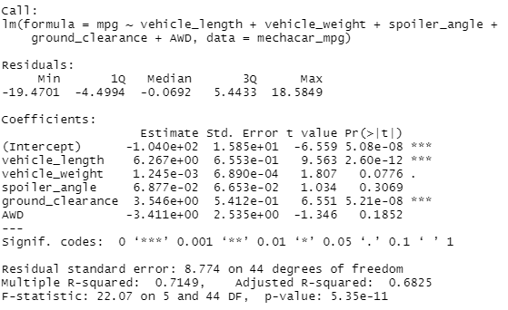
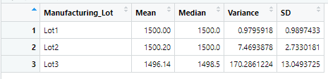
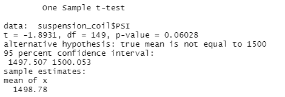
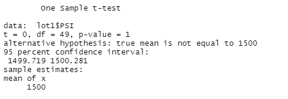
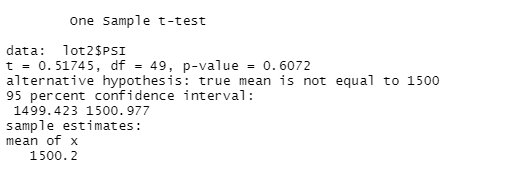
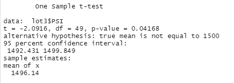

# MechaCar Statistical Analysis
## Overview of the Project
In this project, production data for a prototype car known as the "MechaCar" was reviewed in order to provide insights to assist the manufacturing team.  Four different analyses were performed by importing data sets into RStudio and writing scripts.  First, a multiple linear regression analysis was done to identify which variables in the dataset predict the mpg of MechaCar prototypes.  Second, summary statistics were performed on the pounds per square inch (PSI) of the suspension coils from the manufacturing lots.  Third, t-tests were run to determine if the manufacturing lots are statistically different from the mean population.  Fourth, a statistical study was designed to compare vehicle performance of the MechaCar against vehicles from other manufacturers.  The results of the four analyses are summarized in the paragraphs which follow.
  
## Linear Regression to Predict MPG
A multiple linear regression was performed to identify which variables can be used to predict the mpg of the MechaCar prototypes.  A screenshot of the summary statistics is shown below.  The Pr(>|t|) value represents the probability that each coefficient contributes a random amount of variance to the linear model. According to our results, vehicle length and ground clearance are statistically unlikely to provide random amounts of variance to the linear model. In other words, the vehicle length and ground clearance have a significant impact on the miles per gallon (mpg). It is also worth noting that the intercept is statistically significant, which means that the intercept explains a significant amount of variability in the dependent variable when all independent variables are equal to zero.

As seen in the summary statistics below, the p-value of vehicle length is 2.60 x 10e-12 and ground clearance is 5.21e-08.  This is much smaller than our assumed significance level of 0.05%. Therefore, we can state that there is sufficient evidence to reject the null hypothesis and that the slope of our linear model is not zero.

To quantify how well our linear model can be used to predict future observations, an r-squared value was calculated. From our linear regression model, the r-squared value is 0.7149, which means that roughly 71% of the variability of our mpg is explained using this linear model.  Hence, our model is fairly good at predicting future trends.  

Although the relationships between dependent variable mpg and independent variables vehicle length and ground clearance are statistically significant, the linear model is not perfect. The variability we observed within the mpg data must come from multiple sources of variance and to make better predictions a more robust model should be employed.

## Summary Statistics on Suspension Coils
Summary statistics were performed on the pounds per square inch (PSI) of the suspension coils from three manufacturing lots.  The statistics were first done for all the MechaCars on all lots as a group and these numbers can be seen in the screenshot below.  The design specifications for the MechaCar suspension coils dictate that the variance must not exceed 100 pounds per square inch.  As can be seen in the summary below, when looking at all combined cars from all lots as a group the variance is 62.3 pounds per square inch.  The group as a whole meets the design specifications.   

Next the statistics were done for each of the three manufacturing lots individually and these numbers can be seen in the screenshot below.  The variance for lots 1, 2, and 3 are 0.98, 7.47 and 170.3 pounds per square inch, respectively.  Manufacturing lots 1 and 2 meet the required design specification of having a variance below 100.  However, manufacturing lot 3 exceeds this specification by over 70 pounds per square inch.  

## T-Tests on Suspension Coils
In order to determine if the manufacturing lots were statistically different from the mean population, t-tests were run.  First, all manufacturing lots were compared against the mean PSI of the population.  A screenshot of the t-test performed in R is shown below.  Given the significance level was the common 0.05 percent, the calculated p-value of .06028 is above our significance level. Therefore, we do not have sufficient evidence to reject the null hypothesis and can confidently state that the means are statistically similar.

Second, each manufacturing lot was compared individually agains the mean PSI of the population. A screenshot of the t-test for manufacturing lot 1 is below. The calculated p-value of 1 is above our significance level and hence we can confidently state that the means are statistically similar. 

The screenshot of the t-test for manufacturing lot 2 is below.  The calculated p-value of 0.6072 is above our significance level and hence we can confidently state the means are statistically similar.  

Lastly, the screenshot of the t-test for manufacturing lot 3 is below.  The calculated p-value of 0.04168 is not above our significance level.  Hence, we do have enough evidence to reject the null hypothesis and state that there is a statistical difference between the observed sample mean and the population mean.   

## Study Design: MechaCar vs Competition
In order to compare the MechaCar to manufacturers of other vehicles, a metric with four variables will be employed.  The metrics chosen were researched to be the four most important for consumers in the United States and include:
* Safety - Five-start data ratings will be acquired from the National Highway Traffic Safety Administration.  This nominal data will be sorted according the class of car and then a chi-squared test will be performed to see if there is a difference in categorical frequencies between groups.  The safety rating of the MechaCar will be compared to the frequency of safety ratings of cars in its class.  The null hypothesis is that there is no difference in the safety rating frequency distribution between groups.  The alternate hypothesis is that there is a difference in frequency distribution between car classes.  

* Fuel efficiency - Fuel efficiency data in miles per gallon will be downloaded from the US Department of Energy web site.  Cars from manufacturers with a similar make and model will be filtered from the data.   A one-sample t-test comparing the fuel efficiency of the MechaCar to the mean of the group of similar cars from other manufacturers will be performed.  The null hypothesis is that there is no statistical difference between the MechaCar and other manufacturer's cars. The alternate hypothesis is that there is a statistical difference between the fuel efficiency of the MechaCar and other manufacturer's cars.  

* Suitability for daily driving - a combination of car price, amount of maintenance, and a customer satisfaction rating will be used to determine how well a car is suited for daily driving.  Car price data (numerical) will come from a source such as Kelley Blue Book.  The amount of maintenance a car requires (numerical data) will come from a data source such as Consumer Reports.  Customer satisfaction data (ordinal) will come from a data source such as J.D. Power.  Then a non-parametric statistical analysis using the Kruskal Wallis test will be employed to see if customer satisfaction is related to car price and the amount of maintenance.  The null hypothesis is that there is no statistical difference between the customer satisfaction groups and price or maintenance needs. The alternate hypothesis is that there is a statistical difference between customer satisfaction and the car price or maintenance needs.  

* Comfort - nominal data that rates the comfort of cars will be downloaded for manufacters of other vehicles.  This nominal data will be sorted according the class of car and then a chi-squared test will be performed to see if there is a difference in categorical frequencies between groups.  The comfort rating of the MechaCar will be compared to the frequency of comfort ratings of cars in its class.  The null hypothesis is that there is no difference in the comfort frequency distribution between groups.  The alternate hypothesis is that there is a difference in frequency distribution between car classes. 

